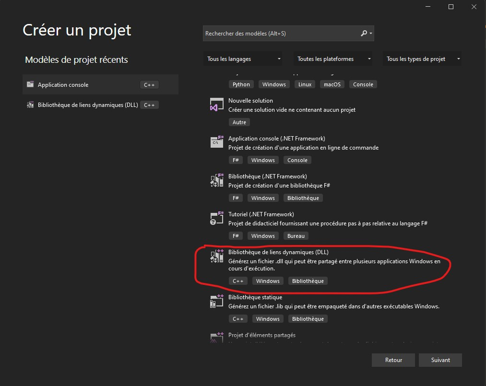
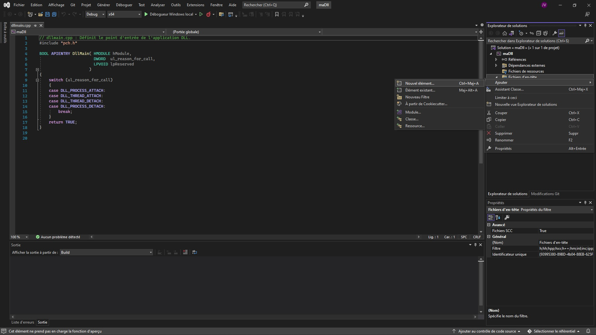
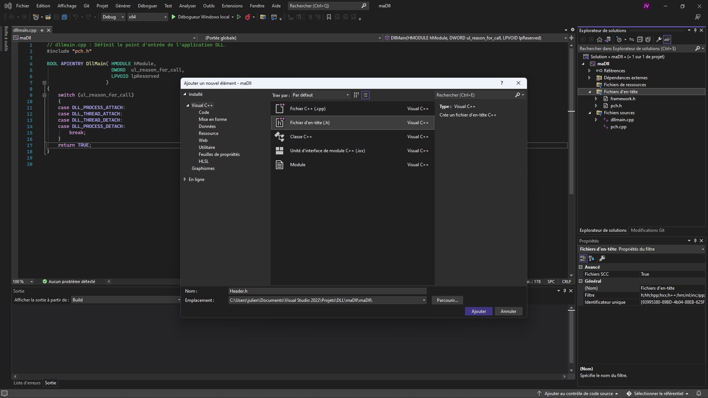
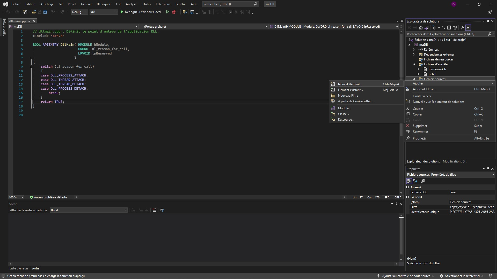
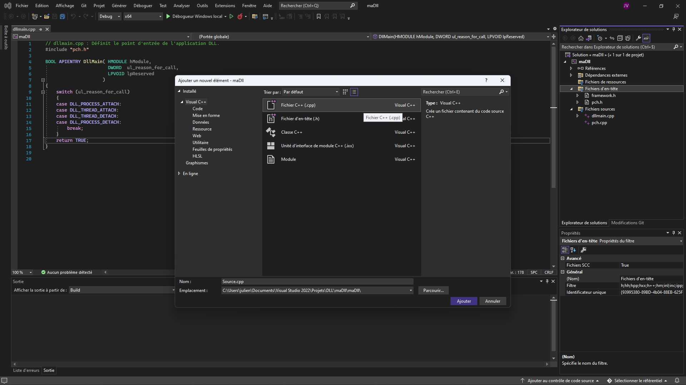
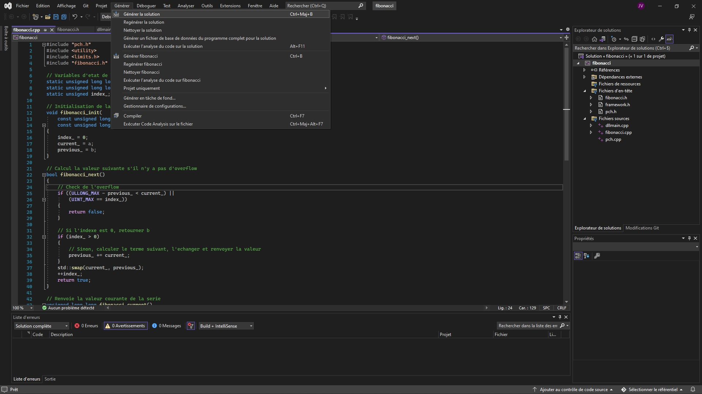
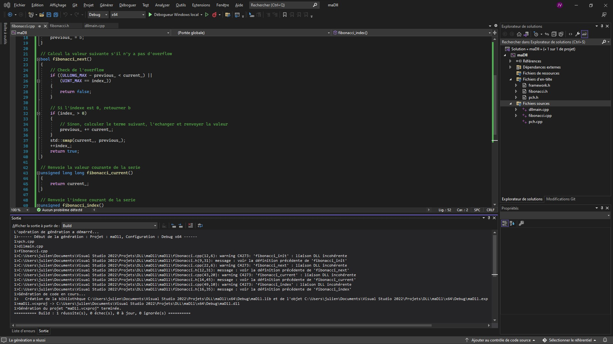

# Tutoriel de création d'une D.L.L écrite en C

Notes sur le tutoriel proposé par Microsoft : [https://docs.microsoft.com/fr-fr/cpp/build/walkthrough-creating-and-using-a-dynamic-link-library-cpp?view=msvc-170](https://docs.microsoft.com/fr-fr/cpp/build/walkthrough-creating-and-using-a-dynamic-link-library-cpp?view=msvc-170).

La procédure de création d'une DLL est la suivante. Ici, on écrit la librairie dynamique en C et l'application cliente en C++. Il s'agit d'une librairie qui calcule les termes de la suite de Fibonacci (généralisée) et le client appelle la fonction de calcul jusqu'à remplir un entier de 64 bits.

On commence par ouvrire Visual Studio.

## Créer un projet D.L.L



## Ajouter un fichier header `fibonacci.h`

Dans le noeud de l'explorateur de projet `Fichiers d'en-tête`, ajouter un fichier `header.h`.





On le rédige ainsi

```cpp
#pragma once

#ifdef FIBONACCI_EXPORTS
#define FIBONACCI_API __declspec(dllexport)
#else
#define FIBONACCI_API __declspec(dllimport)
#endif

extern "C" FIBONACCI_API void fibonacci_init(
    const unsigned long long a, const unsigned long long b);

extern "C" FIBONACCI_API bool fibonacci_next();

extern "C" FIBONACCI_API unsigned long long fibonacci_current();

extern "C" FIBONACCI_API unsigned fibonacci_index();
```

## Ajouter une implémentation pour la D.L.L

On clique sur le noeud `Fichiers sources` et on ajoute un fichier `source.cpp`. 





On le rédige avec

```cpp
#include "pch.h"
#include <utility>
#include <limits.h>
#include "fibonacci.h"

// Variables d'etat de la librairie Fibonacci
static unsigned long long previous_;  // valeur precedente
static unsigned long long current_;   // valur courante
static unsigned index_;               // position de la valeur courante

// Initialisation de la suite de Fibonacci generalisee
void fibonacci_init(
    const unsigned long long a,
    const unsigned long long b)
{
    index_ = 0;
    current_ = a;
    previous_ = b;
}

// Calcul la valeur suivante s'il n'y a pas d'overflow
bool fibonacci_next()
{
    // Check de l'overflow
    if ((ULLONG_MAX - previous_ < current_) ||
        (UINT_MAX == index_))
    {
        return false;
    }

    // Si l'indexe est 0, retourner b
    if (index_ > 0)
    {
        // Sinon, calculer le terme suivant, l'echanger et renvoyer la valeur
        previous_ += current_;
    }
    std::swap(current_, previous_);
    ++index_;
    return true;
}

// Renvoie la valeur courante de la serie
unsigned long long fibonacci_current()
{
    return current_;
}

// Renvoie l'indexe courant de la serie
unsigned fibonacci_index()
{
    return index_;
}
```

## Compiler la librairie dynamique

On peut utiliser le raccourci `<ctrl>+<maj>+b`, raccourci pour 



